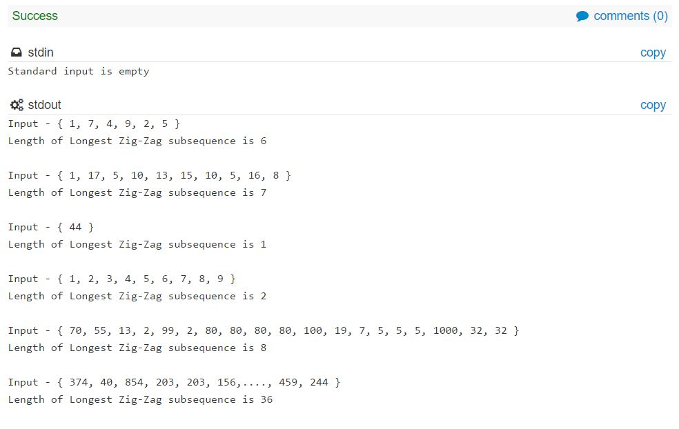
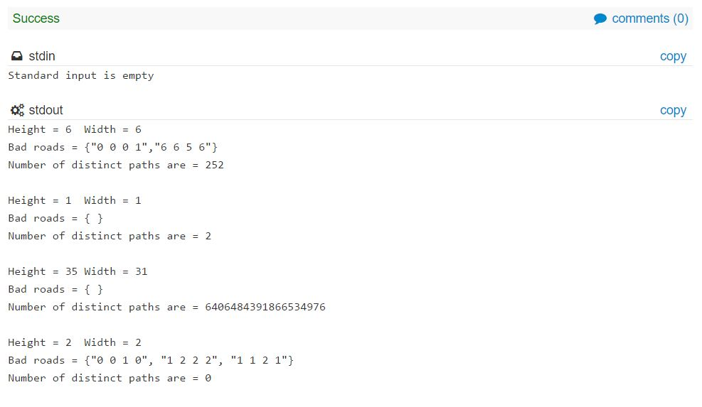
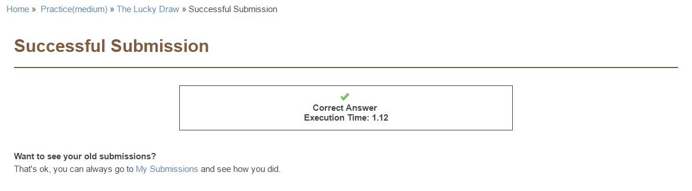

# DP_Assignment_2  
[CSN- 212] [Assignment #2] This repository contains the solutions to the Dynamic Problems assigned.  
  
## Problem 1  
'ZigZag' problem  
https://community.topcoder.com/stat?c=problem_statement&pm=1259  
  
#### Solution -  
The 'output' consists of the test cases as described in the problem statement.  
  
 
  
## Problem 2  
'Avoid Roads' problem  
https://community.topcoder.com/stat?c=problem_statement&pm=1889  

#### Solution -  
The output consists of standar test cases as described in the problem statement.  
  
   
  
## Problem 3  
'Lucky Draw' problem  
https://www.codechef.com/problems/D2/  
  
#### Solution -  
The output has been successfully accepted on CodeChef.  
  
